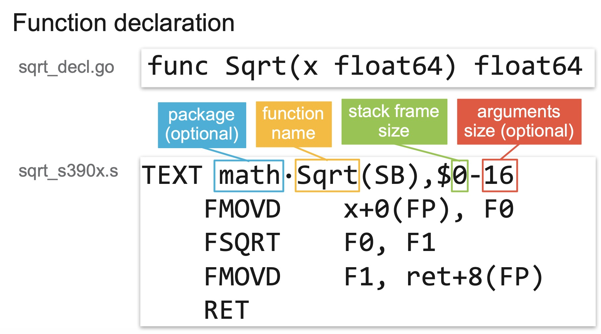

# 汇编 is so easy。

## 为什么要学习汇编

- 装逼


装逼是第一生产力，不服来打我

- 防骗：各种专家和架构师，江湖骗子，牛鬼蛇神，拿着 Go 语言以外的过往经验就忽悠上了

1. 你这么写效率不高，下面可能会有逃逸，你看得按我教你的这么写
2. 我们 java 赋值为 null 就能帮助 GC 判断，所以我也需要用完了 x = nil
3. 这个东西 runtime 里是这样这样那样那样实现的，我这么多年编程经验，你信我的准没错
4. Go 的 xxx 类型参数是引用传递的， yyy 类型参数是值传递的，哥当年研究 C艹 的研究了好久，哥的理解肯定比你权威
5. Go 的调度老牛逼了，稳得很
6. 按照编程语言的一般理论，这个地方肯定就是这么实现的，没错

## 基本概念

### 程序的编译阶段

```
编译 -> 汇编 -> 优化 -> 链接
```

汇编代码在汇编阶段生成，链接阶段会对生成的汇编代码进行修改。(eg0)

实际上优化过程是在所有过程中都有的，这里我们只说汇编优化。

链接阶段会对汇编结果做调整(如将函数地址从偏移量转换为逻辑地址)

### 机器码

所有汇编指令都可以转换为 0101 的序列，如：

```
>> mov rax,0x1
mnemonic : mov rax,0x1 => hex : 48c7c001000000
```
hex 是机器码的 16 进制编码。

### 指令集

RISC/CISC

intel? 难说。

risc 的新轮子 RISCV。

> https://github.com/riscv

CPU 优化指令集，如 x86 平台：SSE/SSE2/AVX。。。AVX512

> https://github.com/golang/go/wiki/AVX512

优化指令集往往能用来加速内存移动，指令运算。基本思想是用硬件方式来做 batch，减少指令数，加速计算。

### 寄存器

寄存器是中央处理器内的组成部分。寄存器是有限存贮容量的高速存贮部件，它们可用来暂存指令、数据和地址。

通用寄存器：
```
ah/al => 8 位
ax/bx => 16 位
eax/ebx => 32 位
rax/rbx => 64 位，8 byte

rax : 0x0000000000000000
```

指令寄存器：

```
pc/rip
```
表示当前我的代码运行到哪里了。


标志寄存器：
```
eflags
```

记录各种运算结果(是否为 0，是否发生溢出)的标志位。

在 dlv 中读取寄存器的值：

```
regs ------------------------ Print contents of CPU registers.
```

```
(dlv) regs
       rax = 0x0000000001053940
       rbx = 0x0000000000000000
       rcx = 0x000000c000000300
       rdx = 0x00000000010750c0
       rdi = 0x0000000000000000
       rsi = 0x0000000000000001
       rbp = 0x000000c0000427d0
       rsp = 0x000000c000042790
        r8 = 0x7fffffffffffffff
        r9 = 0xffffffffffffffff
       r10 = 0x00000000010c0478
       r11 = 0x0000000000000202
       r12 = 0x0000000000203000
       r13 = 0x0000000000000000
       r14 = 0x0000000000000178
       r15 = 0x0000000000000004
       rip = 0x000000000105394f
    rflags = 0x0000000000000202
        cs = 0x000000000000002b
        fs = 0x0000000000000000
        gs = 0x0000000000000000
     fctrl = 0x037f
     fstat = 0x0000
      ftag = 0x0000
       fop = 0x0000
     fioff = 0x00000000
     fiseg = 0x0000
     fooff = 0x00000000
     foseg = 0x0000
     mxcsr = 0x00001fa0	[RZ/RN=0 PM UM OM ZM DM IM PE]
 mxcsrmask = 0x0000ffff
     ST(0) = 0x7fff0000000000000000	-Inf
     ST(1) = 0x00000000000000000000	0
     ST(2) = 0x00000000000000000000	0
     ST(3) = 0x00000000000000000000	0
     ST(4) = 0x00000000000000000000	0
     ST(5) = 0x7fff00000000ff73ff84	-Inf
     ST(6) = 0x7fff00000000022f2d1c	-Inf
     ST(7) = 0x7fff00000000ffffd1fe	-Inf
      XMM0 = 0x00000000000000000000000000000000	v2_int={ 0000000000000000 0000000000000000 }	v4_int={ 00000000 00000000 00000000 00000000 }	v8_int={ 0000 0000 0000 0000 0000 0000 0000 0000 }	v16_int={ 00 00 00 00 00 00 00 00 00 00 00 00 00 00 00 00 }	v2_float={ 0 0 }	v4_float={ 0 0 0 0 }
      YMM0 = 0x00000000000000000000000000000000	v2_int={ 0000000000000000 0000000000000000 }	v4_int={ 00000000 00000000 00000000 00000000 }	v8_int={ 0000 0000 0000 0000 0000 0000 0000 0000 }	v16_int={ 00 00 00 00 00 00 00 00 00 00 00 00 00 00 00 00 }	v2_float={ 0 0 }	v4_float={ 0 0 0 0 }
      XMM1 = 0x00000000000000000000000000000000	v2_int={ 0000000000000000 0000000000000000 }	v4_int={ 00000000 00000000 00000000 00000000 }	v8_int={ 0000 0000 0000 0000 0000 0000 0000 0000 }	v16_int={ 00 00 00 00 00 00 00 00 00 00 00 00 00 00 00 00 }	v2_float={ 0 0 }	v4_float={ 0 0 0 0 }
      YMM1 = 0x00000000000000000000000000000000	v2_int={ 0000000000000000 0000000000000000 }	v4_int={ 00000000 00000000 00000000 00000000 }	v8_int={ 0000 0000 0000 0000 0000 0000 0000 0000 }	v16_int={ 00 00 00 00 00 00 00 00 00 00 00 00 00 00 00 00 }	v2_float={ 0 0 }	v4_float={ 0 0 0 0 }
      XMM2 = 0x00706565777367622e656d69746e7572	v2_int={ 2e656d69746e7572 0070656577736762 }	v4_int={ 746e7572 2e656d69 77736762 00706565 }	v8_int={ 7572 746e 6d69 2e65 6762 7773 6565 0070 }	v16_int={ 72 75 6e 74 69 6d 65 2e 62 67 73 77 65 65 70 00 }	v2_float={ 3.446835183876702e-85 1.4592995157673208e-306 }	v4_float={ 7.55706e+31 5.2165747e-11 4.9368164e+33 1.0321949e-38 }
      YMM2 = 0x00000000000000000000000000000000	v2_int={ 0000000000000000 0000000000000000 }	v4_int={ 00000000 00000000 00000000 00000000 }	v8_int={ 0000 0000 0000 0000 0000 0000 0000 0000 }	v16_int={ 00 00 00 00 00 00 00 00 00 00 00 00 00 00 00 00 }	v2_float={ 0 0 }	v4_float={ 0 0 0 0 }
      XMM3 = 0xff000000000000000000000000000000	v2_int={ 0000000000000000 ff00000000000000 }	v4_int={ 00000000 00000000 00000000 ff000000 }	v8_int={ 0000 0000 0000 0000 0000 0000 0000 ff00 }	v16_int={ 00 00 00 00 00 00 00 00 00 00 00 00 00 00 00 ff }	v2_float={ 0 -5.486124068793689e+303 }	v4_float={ 0 0 0 -1.7014118e+38 }
      YMM3 = 0x00000000000000000000000000000000	v2_int={ 0000000000000000 0000000000000000 }	v4_int={ 00000000 00000000 00000000 00000000 }	v8_int={ 0000 0000 0000 0000 0000 0000 0000 0000 }	v16_int={ 00 00 00 00 00 00 00 00 00 00 00 00 00 00 00 00 }	v2_float={ 0 0 }	v4_float={ 0 0 0 0 }
      XMM4 = 0x3a31303b33333d64633a31303b36333d	v2_int={ 633a31303b36333d 3a31303b33333d64 }	v4_int={ 3b36333d 633a3130 33333d64 3a31303b }	v8_int={ 333d 3b36 3130 633a 3d64 3333 303b 3a31 }	v16_int={ 3d 33 36 3b 30 31 3a 63 64 3d 33 33 3b 30 31 3a }	v2_float={ 9.884816049279249e+169 2.16948150441166e-28 }	v4_float={ 0.0027801536 3.4346387e+21 4.173252e-08 0.0006759201 }
      YMM4 = 0x00000000000000000000000000000000	v2_int={ 0000000000000000 0000000000000000 }	v4_int={ 00000000 00000000 00000000 00000000 }	v8_int={ 0000 0000 0000 0000 0000 0000 0000 0000 }	v16_int={ 00 00 00 00 00 00 00 00 00 00 00 00 00 00 00 00 }	v2_float={ 0 0 }	v4_float={ 0 0 0 0 }
      XMM5 = 0x333d67733a37303b30343b31333d7573	v2_int={ 30343b31333d7573 333d67733a37303b }	v4_int={ 333d7573 30343b31 3a37303b 333d6773 }	v8_int={ 7573 333d 3b31 3034 303b 3a37 6773 333d }	v16_int={ 73 75 3d 33 31 3b 34 30 3b 30 37 3a 73 67 3d 33 }	v2_float={ 1.747202215459339e-76 7.147741244431301e-62 }	v4_float={ 4.411181e-08 6.5567735e-10 0.0006988083 4.4099078e-08 }
      YMM5 = 0x00000000000000000000000000000000	v2_int={ 0000000000000000 0000000000000000 }	v4_int={ 00000000 00000000 00000000 00000000 }	v8_int={ 0000 0000 0000 0000 0000 0000 0000 0000 }	v16_int={ 00 00 00 00 00 00 00 00 00 00 00 00 00 00 00 00 }	v2_float={ 0 0 }	v4_float={ 0 0 0 0 }
      XMM6 = 0x30343b32333d77743a37303b30343b36	v2_int={ 3a37303b30343b36 30343b32333d7774 }	v4_int={ 30343b36 3a37303b 333d7774 30343b32 }	v8_int={ 3b36 3034 303b 3a37 7774 333d 3b32 3034 }	v16_int={ 36 3b 34 30 3b 30 37 3a 74 77 3d 33 32 3b 34 30 }	v2_float={ 2.926787950883477e-28 1.7472035332342394e-76 }	v4_float={ 6.556776e-10 0.0006988083 4.4113634e-08 6.556774e-10 }
      YMM6 = 0x00000000000000000000000000000000	v2_int={ 0000000000000000 0000000000000000 }	v4_int={ 00000000 00000000 00000000 00000000 }	v8_int={ 0000 0000 0000 0000 0000 0000 0000 0000 }	v16_int={ 00 00 00 00 00 00 00 00 00 00 00 00 00 00 00 00 }	v2_float={ 0 0 }	v4_float={ 0 0 0 0 }
      XMM7 = 0x3a37303b30343b33333d776f3a37303b	v2_int={ 333d776f3a37303b 3a37303b30343b33 }	v4_int={ 3a37303b 333d776f 30343b33 3a37303b }	v8_int={ 303b 3a37 776f 333d 3b33 3034 303b 3a37 }	v16_int={ 3b 30 37 3a 6f 77 3d 33 33 3b 34 30 3b 30 37 3a }	v2_float={ 7.162919315999914e-62 2.9267879508834756e-28 }	v4_float={ 0.0006988083 4.4113616e-08 6.5567746e-10 0.0006988083 }
      YMM7 = 0x00000000000000000000000000000000	v2_int={ 0000000000000000 0000000000000000 }	v4_int={ 00000000 00000000 00000000 00000000 }	v8_int={ 0000 0000 0000 0000 0000 0000 0000 0000 }	v16_int={ 00 00 00 00 00 00 00 00 00 00 00 00 00 00 00 00 }	v2_float={ 0 0 }	v4_float={ 0 0 0 0 }
      XMM8 = 0x6e6962732f6c61636f6c2f7273752f3a	v2_int={ 6f6c2f7273752f3a 6e6962732f6c6163 }	v4_int={ 73752f3a 6f6c2f72 2f6c6163 6e696273 }	v8_int={ 2f3a 7375 2f72 6f6c 6163 2f6c 6273 6e69 }	v16_int={ 3a 2f 75 73 72 2f 6c 6f 63 61 6c 2f 73 62 69 6e }	v2_float={ 5.34158331241814e+228 7.340685338891256e+223 }	v4_float={ 1.9425516e+31 7.309582e+28 2.1498674e-10 1.8057256e+28 }
      YMM8 = 0x00000000000000000000000000000000	v2_int={ 0000000000000000 0000000000000000 }	v4_int={ 00000000 00000000 00000000 00000000 }	v8_int={ 0000 0000 0000 0000 0000 0000 0000 0000 }	v16_int={ 00 00 00 00 00 00 00 00 00 00 00 00 00 00 00 00 }	v2_float={ 0 0 }	v4_float={ 0 0 0 0 }
      XMM9 = 0x2f3a6e69622f3a6e69622f7273752f3a	v2_int={ 69622f7273752f3a 2f3a6e69622f3a6e }	v4_int={ 73752f3a 69622f72 622f3a6e 2f3a6e69 }	v8_int={ 2f3a 7375 2f72 6962 3a6e 622f 6e69 2f3a }	v16_int={ 3a 2f 75 73 72 2f 62 69 6e 3a 2f 62 69 6e 3a 2f }	v2_float={ 4.3499931289042936e+199 3.4830493665207283e-81 }	v4_float={ 1.9425516e+31 1.7090081e+25 8.080976e+20 1.6955827e-10 }
      YMM9 = 0x00000000000000000000000000000000	v2_int={ 0000000000000000 0000000000000000 }	v4_int={ 00000000 00000000 00000000 00000000 }	v8_int={ 0000 0000 0000 0000 0000 0000 0000 0000 }	v16_int={ 00 00 00 00 00 00 00 00 00 00 00 00 00 00 00 00 }	v2_float={ 0 0 }	v4_float={ 0 0 0 0 }
     XMM10 = 0x2f3a6e6962732f3a6e6962732f727375	v2_int={ 6e6962732f727375 2f3a6e6962732f3a }	v4_int={ 2f727375 6e696273 62732f3a 2f3a6e69 }	v8_int={ 7375 2f72 6273 6e69 2f3a 6273 6e69 2f3a }	v16_int={ 75 73 72 2f 73 62 69 6e 3a 2f 73 62 69 6e 3a 2f }	v2_float={ 7.340685339299987e+223 3.4830493686057503e-81 }	v4_float={ 2.205079e-10 1.8057256e+28 1.12149046e+21 1.6955827e-10 }
     YMM10 = 0x00000000000000000000000000000000	v2_int={ 0000000000000000 0000000000000000 }	v4_int={ 00000000 00000000 00000000 00000000 }	v8_int={ 0000 0000 0000 0000 0000 0000 0000 0000 }	v16_int={ 00 00 00 00 00 00 00 00 00 00 00 00 00 00 00 00 }	v2_float={ 0 0 }	v4_float={ 0 0 0 0 }
     XMM11 = 0x6e69622f6f672f6c61636f6c2f727375	v2_int={ 61636f6c2f727375 6e69622f6f672f6c }	v4_int={ 2f727375 61636f6c 6f672f6c 6e69622f }	v8_int={ 7375 2f72 6f6c 6163 2f6c 6f67 622f 6e69 }	v16_int={ 75 73 72 2f 6c 6f 63 61 6c 2f 67 6f 2f 62 69 6e }	v2_float={ 1.3662107766268992e+161 7.340386390188806e+223 }	v4_float={ 2.205079e-10 2.6221498e+20 7.1548367e+28 1.8057176e+28 }
     YMM11 = 0x00000000000000000000000000000000	v2_int={ 0000000000000000 0000000000000000 }	v4_int={ 00000000 00000000 00000000 00000000 }	v8_int={ 0000 0000 0000 0000 0000 0000 0000 0000 }	v16_int={ 00 00 00 00 00 00 00 00 00 00 00 00 00 00 00 00 }	v2_float={ 0 0 }	v4_float={ 0 0 0 0 }
     XMM12 = 0x572f736e6f69746163696c7070412f3a	v2_int={ 63696c7070412f3a 572f736e6f697461 }	v4_int={ 70412f3a 63696c70 6f697461 572f736e }	v8_int={ 2f3a 7041 6c70 6369 7461 6f69 736e 572f }	v16_int={ 3a 2f 41 70 70 6c 69 63 61 74 69 6f 6e 73 2f 57 }	v2_float={ 7.675814073001636e+170 9.454564732925896e+111 }	v4_float={ 2.391508e+29 4.305905e+21 7.22507e+28 1.929103e+14 }
     YMM12 = 0x00000000000000000000000000000000	v2_int={ 0000000000000000 0000000000000000 }	v4_int={ 00000000 00000000 00000000 00000000 }	v8_int={ 0000 0000 0000 0000 0000 0000 0000 0000 }	v16_int={ 00 00 00 00 00 00 00 00 00 00 00 00 00 00 00 00 }	v2_float={ 0 0 }	v4_float={ 0 0 0 0 }
     XMM13 = 0x6e6f432f7070612e6b72616873657269	v2_int={ 6b72616873657269 6e6f432f7070612e }	v4_int={ 73657269 6b726168 7070612e 6e6f432f }	v8_int={ 7269 7365 6168 6b72 612e 7070 432f 6e6f }	v16_int={ 69 72 65 73 68 61 72 6b 2e 61 70 70 2f 43 6f 6e }	v2_float={ 3.776715943768552e+209 9.04044281118662e+223 }	v4_float={ 1.8178657e+31 2.9302004e+26 2.9757554e+29 1.8512034e+28 }
     YMM13 = 0x00000000000000000000000000000000	v2_int={ 0000000000000000 0000000000000000 }	v4_int={ 00000000 00000000 00000000 00000000 }	v8_int={ 0000 0000 0000 0000 0000 0000 0000 0000 }	v16_int={ 00 00 00 00 00 00 00 00 00 00 00 00 00 00 00 00 }	v2_float={ 0 0 }	v4_float={ 0 0 0 0 }
     XMM14 = 0x6573552f3a534f63614d2f73746e6574	v2_int={ 614d2f73746e6574 6573552f3a534f63 }	v4_int={ 746e6574 614d2f73 3a534f63 6573552f }	v8_int={ 6574 746e 2f73 614d 4f63 3a53 552f 6573 }	v16_int={ 74 65 6e 74 73 2f 4d 61 63 4f 53 3a 2f 55 73 65 }	v2_float={ 5.1289999310656885e+160 5.013847184688216e+180 }	v4_float={ 7.5550804e+31 2.365626e+20 0.0008060841 7.181915e+22 }
     YMM14 = 0x00000000000000000000000000000000	v2_int={ 0000000000000000 0000000000000000 }	v4_int={ 00000000 00000000 00000000 00000000 }	v8_int={ 0000 0000 0000 0000 0000 0000 0000 0000 }	v16_int={ 00 00 00 00 00 00 00 00 00 00 00 00 00 00 00 00 }	v2_float={ 0 0 }	v4_float={ 0 0 0 0 }
     XMM15 = 0x6e69622f6f672f6e69677261782f7372	v2_int={ 69677261782f7372 6e69622f6f672f6e }	v4_int={ 782f7372 69677261 6f672f6e 6e69622f }	v8_int={ 7372 782f 7261 6967 2f6e 6f67 622f 6e69 }	v16_int={ 72 73 2f 78 61 72 67 69 6e 2f 67 6f 2f 62 69 6e }	v2_float={ 5.608551565561017e+199 7.340386390188808e+223 }	v4_float={ 1.4234273e+34 1.7487625e+25 7.1548376e+28 1.8057176e+28 }
     YMM15 = 0x00000000000000000000000000000000	v2_int={ 0000000000000000 0000000000000000 }	v4_int={ 00000000 00000000 00000000 00000000 }	v8_int={ 0000 0000 0000 0000 0000 0000 0000 0000 }	v16_int={ 00 00 00 00 00 00 00 00 00 00 00 00 00 00 00 00 }	v2_float={ 0 0 }	v4_float={ 0 0 0 0 }
    trapno = 0x00000001
       err = 0x00000000
faultvaddr = 0x00000000010ee000
```

大部分不需要理解，知道通用寄存器和简单的扩展寄存器就好了。

### 基础指令

```
mov rax, 0x1 // rax = 1
add rax, 11  // rax = rax + 11
sub rax,1    // rax = rax - 1

// 在寄存器之间搬数据
mov rax, rbx // rax = rbx

// 在寄存器和内存之间搬数据
mov rax, [rbx] // 把 rbx 寄存器的值看作一个地址，把该物理地址的值取出，然后赋值给 rax，即 rax = *rbx

// 在内存之间搬数据
- 你想多了，不可以的

push rax => 将 rax 的值存储到栈顶，并将 rsp 上移 8 个字节
pop rax => 将 rsp 指向的内存位置的 8 个字节移动到 rax，并将 rax 从栈顶下移 8 个字节

jmp addr => 跳转到指定地址
```

### 函数 or 过程

函数调用在汇编上的本质：

```
jmp 跳进去
jmp 跳回来
```

cpu 很傻，跳回来的时候我必须到当前过程的下一条指令位置，难道我还需要在被调用过程里知道调用者的过程下一条指令位置？

```
call => push pc; jmp to callee addr;
ret => pop pc;
```

要点，在栈上记录下一条指令位置，即我们常说的 `return address`，理解成路标就行。在执行完被调用函数的时候，顺着路标回去继续向下走。

### 高级语言函数

函数栈：
```
                         +--------------+
                         |              |
                    +    |              |
                    |    +--------------+
                    |    |              |
                    |    |   arg(N-1)   |  starts from 7'th argument for x86_64
                    |    |              |
                    |    +--------------+
                    |    |              |
                    |    |     argN     |
                    |    |              |
                    |    +--------------+
                    |    |              |
                    |    |Return address|  %rbp + 8
Stack grows down    |    |              |
                    |    +--------------+
                    |    |              |
                    |    |     %rbp     |  Frame base pointer
                    |    |              |
                    |    +--------------+
                    |    |              |
                    |    |  local var1  |  %rbp - 8
                    |    |              |
                    |    +--------------+
                    |    |              |
                    |    | local var 2  | <-- %rsp
                    |    |              |
                    v    +--------------+
                         |              |
                         |              |
                         +--------------+
```

调用规约：

参考这里：
> https://github.com/cch123/llp-trans/blob/master/part3/translation-details/function-calling-sequence/calling-convention.md

主要是知道哪些寄存器是需要 caller save，哪些是 callee save。

### 和系统打交道

```
section .data
message: db 'hello, world!', 10

section .text
global _start

_start:
    mov     rax, 1              ; 'write' syscall number
    mov     rdi, 1              ; stdout descriptor
    mov     rsi, message        ; string address
    mov     rdx, 14             ; string length in bytes
    syscall   ; 重点在这里
```

更具体的可以参考 [这里](https://github.com/cch123/llp-trans/blob/d6b7f46c72e83ac9145d5534c6bc4e690da8d815/part1/assembly-language/writing-hello-world/basic-instructions.md)

和[这里](http://blog.rchapman.org/posts/Linux_System_Call_Table_for_x86_64/)

## plan9 汇编

- 寄存器名差别

```
rax -> AX
rbx -> BX
r8  -> R8
```

因为移动多少个字节是由指令而不是操作数决定的，所以稍微省心一些。

- 指令对应关系

```
MOVB $1, DI -> mov al, 0x44    // 1 byte
MOVW $0x10, BX -> mov ax, 0x10 // 2 bytes
MOVD $100, DX -> mov eax, 100  // 4 bytes
MOVQ $-10, AX -> mov rax, -10  // 8 bytes
```

可以看到，指令的操作数是反着的，大部分 plan9 和 intel 的指令确实是反着的关系，学习过汇编的同学可能会认为很好啊，这样 plan9 的操作数顺序应该是和 AT&T 一致了，遗憾的是也有例外：

```
Mnemonic | Go operands           | AT&T operands
================================================
BOUNDW   | m16&16, r16           | r16, m16&16
BOUNDL   | m32&32, r32           | r32, m32&32
CMPB     | AL, imm8              | imm8, AL
CMPW     | AX, imm16             | imm16, AX
CMPL     | EAX, imm32            | imm32, EAX
CMPQ     | RAX, imm32            | imm32, RAX
CMPW     | r/m16, imm16          | imm16, r/m16
CMPW     | r/m16, imm8           | imm8, r/m16
CMPW     | r/m16, r16            | r16, r/m16
CMPL     | r/m32, imm32          | imm32, r/m32
CMPL     | r/m32, imm8           | imm8, r/m32
CMPL     | r/m32, r32            | r32, r/m32
CMPQ     | r/m64, imm32          | imm32, r/m64
CMPQ     | r/m64, imm8           | imm8, r/m64
CMPQ     | r/m64, r64            | r64, r/m64
CMPB     | r/m8, imm8            | imm8, r/m8
CMPB     | r/m8, imm8            | imm8, r/m8
CMPB     | r/m8, r8              | r8, r/m8
CMPB     | r/m8, r8              | r8, r/m8
CMPW     | r16, r/m16            | r/m16, r16
CMPL     | r32, r/m32            | r/m32, r32
CMPQ     | r64, r/m64            | r/m64, r64
CMPB     | r8, r/m8              | r/m8, r8
CMPB     | r8, r/m8              | r/m8, r8
CMPPD    | imm8, xmm1, xmm2/m128 | imm8, xmm2/m128, xmm1
CMPPS    | imm8, xmm1, xmm2/m128 | imm8, xmm2/m128, xmm1
CMPSD    | imm8, xmm1, xmm2/m64  | imm8, xmm2/m64, xmm1
CMPSS    | imm8, xmm1, xmm2/m32  | imm8, xmm2/m32, xmm1
ENTER    | 0, imm16              | imm16, 0
ENTER    | 1, imm16              | imm16, 1
```

## 使用汇编知识

### 程序的基本分段

```
.data : 有初始化值的全局变量；定义常量。
.bss : 没有初始化值的全局变量。
.text : 代码段。
.rodata: 只读数据段。
```

代码在 .text 段中，大概知道就行。Go 语言用户程序的入口为 main.main。

可以使用 objdump 来看 intel 指令的反汇编结果：

```go
package main

func main() {
	println("hello")
}

000000000044c150 <main.main>:
  44c150:       64 48 8b 0c 25 f8 ff    mov    rcx,QWORD PTR fs:0xfffffffffffffff8
  44c157:       ff ff
  44c159:       48 3b 61 10             cmp    rsp,QWORD PTR [rcx+0x10]
  44c15d:       76 3b                   jbe    44c19a <main.main+0x4a>
  44c15f:       48 83 ec 18             sub    rsp,0x18
  44c163:       48 89 6c 24 10          mov    QWORD PTR [rsp+0x10],rbp
  44c168:       48 8d 6c 24 10          lea    rbp,[rsp+0x10]
  44c16d:       e8 8e 59 fd ff          call   421b00 <runtime.printlock>
  44c172:       48 8d 05 ba dc 01 00    lea    rax,[rip+0x1dcba]        # 469e33 <go.string.*+0x1e3>
  44c179:       48 89 04 24             mov    QWORD PTR [rsp],rax
  44c17d:       48 c7 44 24 08 06 00    mov    QWORD PTR [rsp+0x8],0x6
  44c184:       00 00
  44c186:       e8 b5 62 fd ff          call   422440 <runtime.printstring>
  44c18b:       e8 f0 59 fd ff          call   421b80 <runtime.printunlock>
  44c190:       48 8b 6c 24 10          mov    rbp,QWORD PTR [rsp+0x10]
  44c195:       48 83 c4 18             add    rsp,0x18
  44c199:       c3                      ret
  44c19a:       e8 d1 83 ff ff          call   444570 <runtime.morestack_noctxt>
  44c19f:       eb af                   jmp    44c150 <main.main>
  44c1a1:       cc                      int3
```

### Go 反汇编工具

```
go tool compile -S
```

输出的汇编代码还没有链接，呈现的地址都是偏移量。

```
go tool objdump
```

相当于反汇编你的程序，会丢失很多信息。

```go
package main

func main() {
	println("hello")
}

TEXT main.main(SB) /home/vagrant/a.go
  a.go:3                0x44c150                64488b0c25f8ffffff      MOVQ FS:0xfffffff8, CX
  a.go:3                0x44c159                483b6110                CMPQ 0x10(CX), SP
  a.go:3                0x44c15d                763b                    JBE 0x44c19a
  a.go:3                0x44c15f                4883ec18                SUBQ $0x18, SP
  a.go:3                0x44c163                48896c2410              MOVQ BP, 0x10(SP)
  a.go:3                0x44c168                488d6c2410              LEAQ 0x10(SP), BP
  a.go:4                0x44c16d                e88e59fdff              CALL runtime.printlock(SB)
  a.go:4                0x44c172                488d05badc0100          LEAQ 0x1dcba(IP), AX
  a.go:4                0x44c179                48890424                MOVQ AX, 0(SP)
  a.go:4                0x44c17d                48c744240806000000      MOVQ $0x6, 0x8(SP)
  a.go:4                0x44c186                e8b562fdff              CALL runtime.printstring(SB)
  a.go:4                0x44c18b                e8f059fdff              CALL runtime.printunlock(SB)
  a.go:5                0x44c190                488b6c2410              MOVQ 0x10(SP), BP
  a.go:5                0x44c195                4883c418                ADDQ $0x18, SP
  a.go:5                0x44c199                c3                      RET
  a.go:3                0x44c19a                e8d183ffff              CALL runtime.morestack_noctxt(SB)
  a.go:3                0x44c19f                ebaf                    JMP main.main(SB)
```

当你手写汇编时，与 `go tool compile -S` 和 `objdump` 的是不一样的，不要直接照着这个结果来写！

### 查看 Go 语言的函数调用规约

```
                                                                                                                              
                                       caller                                                                                 
                                 +------------------+                                                                         
                                 |                  |                                                                         
       +---------------------->  --------------------                                                                         
       |                         |                  |                                                                         
       |                         | caller parent BP |                                                                         
       |           BP(pseudo SP) --------------------                                                                         
       |                         |                  |                                                                         
       |                         |   Local Var0     |                                                                         
       |                         --------------------                                                                         
       |                         |                  |                                                                         
       |                         |   .......        |                                                                         
       |                         --------------------                                                                         
       |                         |                  |                                                                         
       |                         |   Local VarN     |                                                                         
                                 --------------------                                                                         
 caller stack frame              |                  |                                                                         
                                 |   callee arg2    |                                                                         
       |                         |------------------|                                                                         
       |                         |                  |                                                                         
       |                         |   callee arg1    |                                                                         
       |                         |------------------|                                                                         
       |                         |                  |                                                                         
       |                         |   callee arg0    |                                                                         
       |                         ----------------------------------------------+   FP(virtual register)                       
       |                         |                  |                          |                                              
       |                         |   return addr    |  parent return address   |                                              
       +---------------------->  +------------------+---------------------------    <-------------------------------+         
                                                    |  caller BP               |                                    |         
                                                    |  (caller frame pointer)  |                                    |         
                                     BP(pseudo SP)  ----------------------------                                    |         
                                                    |                          |                                    |         
                                                    |     Local Var0           |                                    |         
                                                    ----------------------------                                    |         
                                                    |                          |                                              
                                                    |     Local Var1           |                                              
                                                    ----------------------------                            callee stack frame
                                                    |                          |                                              
                                                    |       .....              |                                              
                                                    ----------------------------                                    |         
                                                    |                          |                                    |         
                                                    |     Local VarN           |                                    |         
                                  SP(Real Register) ----------------------------                                    |         
                                                    |                          |                                    |         
                                                    |                          |                                    |         
                                                    |                          |                                    |         
                                                    |                          |                                    |         
                                                    |                          |                                    |         
                                                    +--------------------------+    <-------------------------------+         
                                                                                                                              
                                                              callee
```


### 确定应用层代码被翻译为哪些 runtime 函数

#### 例，查看 defer 的执行过程：

```go
package main

func f() int {
	var res = 0
	defer func() {
		res++
	}()
	return res
}

func main() {}
```

```
"".f STEXT size=137 args=0x8 locals=0x28
	0x0000 00000 (defer.go:3)	TEXT	"".f(SB), $40-8
	0x0000 00000 (defer.go:3)	MOVQ	(TLS), CX
	0x0009 00009 (defer.go:3)	CMPQ	SP, 16(CX)
	0x000d 00013 (defer.go:3)	JLS	127
	0x000f 00015 (defer.go:3)	SUBQ	$40, SP
	0x0013 00019 (defer.go:3)	MOVQ	BP, 32(SP)
	0x0018 00024 (defer.go:3)	LEAQ	32(SP), BP
	0x001d 00029 (defer.go:3)	FUNCDATA	$0, gclocals·33cdeccccebe80329f1fdbee7f5874cb(SB)
	0x001d 00029 (defer.go:3)	FUNCDATA	$1, gclocals·33cdeccccebe80329f1fdbee7f5874cb(SB)
	0x001d 00029 (defer.go:3)	FUNCDATA	$3, gclocals·9fb7f0986f647f17cb53dda1484e0f7a(SB)
	0x001d 00029 (defer.go:3)	PCDATA	$2, $0
	0x001d 00029 (defer.go:3)	PCDATA	$0, $0
	0x001d 00029 (defer.go:3)	MOVQ	$0, "".~r0+48(SP)
	0x0026 00038 (defer.go:4)	MOVQ	$0, "".res+24(SP)
	0x002f 00047 (defer.go:7)	PCDATA	$2, $1
	0x002f 00047 (defer.go:7)	LEAQ	"".res+24(SP), AX
	0x0034 00052 (defer.go:7)	PCDATA	$2, $0
	0x0034 00052 (defer.go:7)	MOVQ	AX, 16(SP)
	0x0039 00057 (defer.go:5)	MOVL	$8, (SP)
	0x0040 00064 (defer.go:5)	PCDATA	$2, $1
	0x0040 00064 (defer.go:5)	LEAQ	"".f.func1·f(SB), AX
	0x0047 00071 (defer.go:5)	PCDATA	$2, $0
	0x0047 00071 (defer.go:5)	MOVQ	AX, 8(SP)
	0x004c 00076 (defer.go:5)	CALL	runtime.deferproc(SB)
	0x0051 00081 (defer.go:5)	TESTL	AX, AX
	0x0053 00083 (defer.go:5)	JNE	111
	0x0055 00085 (defer.go:8)	MOVQ	"".res+24(SP), AX
	0x005a 00090 (defer.go:8)	MOVQ	AX, "".~r0+48(SP)
	0x005f 00095 (defer.go:8)	XCHGL	AX, AX
	0x0060 00096 (defer.go:8)	CALL	runtime.deferreturn(SB)
	0x0065 00101 (defer.go:8)	MOVQ	32(SP), BP
	0x006a 00106 (defer.go:8)	ADDQ	$40, SP
	0x006e 00110 (defer.go:8)	RET
	0x006f 00111 (defer.go:5)	XCHGL	AX, AX
	0x0070 00112 (defer.go:5)	CALL	runtime.deferreturn(SB)
	0x0075 00117 (defer.go:5)	MOVQ	32(SP), BP
	0x007a 00122 (defer.go:5)	ADDQ	$40, SP
	0x007e 00126 (defer.go:5)	RET
	0x007f 00127 (defer.go:5)	NOP
	0x007f 00127 (defer.go:3)	PCDATA	$0, $-1
	0x007f 00127 (defer.go:3)	PCDATA	$2, $-1
	0x007f 00127 (defer.go:3)	CALL	runtime.morestack_noctxt(SB)
	0x0084 00132 (defer.go:3)	JMP	0
```

defer 提供给你是用来关闭各种资源，恢复 panic 程序现场的。

不是给你炫技或者面试别人的。

劝君善良。

#### 例，查看 map 被翻译为的 runtime 函数

```go
package main

import "fmt"

func main() {
	var a = map[int]int{}
	a[1] = 1
	fmt.Println(a)
}
```

```shell
go tool compile -S map.go | grep 'map.go:6'
```

```
	0x0021 00033 (map.go:6)	PCDATA	$2, $0
	0x0021 00033 (map.go:6)	PCDATA	$0, $0
	0x0021 00033 (map.go:6)	CALL	runtime.makemap_small(SB)
	0x0026 00038 (map.go:6)	PCDATA	$2, $1
	0x0026 00038 (map.go:6)	MOVQ	(SP), AX
	0x002a 00042 (map.go:6)	PCDATA	$0, $1
	0x002a 00042 (map.go:6)	MOVQ	AX, "".a+48(SP)
```

只要再去 runtime 源代码中寻找 makemap_small 的定义即可。

#### 例，查看内存是否在堆上分配：

```go
package main

import "fmt"

func main() {
	var a = new([]int)
	fmt.Println(a)
}
```

```
	0x001d 00029 (alloc.go:6)	PCDATA	$0, $0
	0x001d 00029 (alloc.go:6)	LEAQ	type.[]int(SB), AX
	0x0024 00036 (alloc.go:6)	PCDATA	$2, $0
	0x0024 00036 (alloc.go:6)	MOVQ	AX, (SP)
	0x0028 00040 (alloc.go:6)	CALL	runtime.newobject(SB)
	0x002d 00045 (alloc.go:6)	PCDATA	$2, $1
	0x002d 00045 (alloc.go:6)	MOVQ	8(SP), AX
```

#### 例，查看 Go 语言的编译器是否进行了尾递归优化：

```go
package main

func f(i int) int {
	if i == 0 || i == 1 {
		return i
	}
	return f(i - 1)
}

func main() {
	println(f(666665535))
}
```

```go
"".f STEXT size=99 args=0x10 locals=0x18
	0x0000 00000 (recur.go:3)	TEXT	"".f(SB), $24-16
	0x0000 00000 (recur.go:3)	MOVQ	(TLS), CX
	0x0009 00009 (recur.go:3)	CMPQ	SP, 16(CX)
	0x000d 00013 (recur.go:3)	JLS	92
	0x000f 00015 (recur.go:3)	SUBQ	$24, SP
	0x0013 00019 (recur.go:3)	MOVQ	BP, 16(SP)
	0x0018 00024 (recur.go:3)	LEAQ	16(SP), BP
	0x001d 00029 (recur.go:3)	FUNCDATA	$0, gclocals·33cdeccccebe80329f1fdbee7f5874cb(SB)
	0x001d 00029 (recur.go:3)	FUNCDATA	$1, gclocals·33cdeccccebe80329f1fdbee7f5874cb(SB)
	0x001d 00029 (recur.go:3)	FUNCDATA	$3, gclocals·33cdeccccebe80329f1fdbee7f5874cb(SB)
	0x001d 00029 (recur.go:4)	PCDATA	$2, $0
	0x001d 00029 (recur.go:4)	PCDATA	$0, $0
	0x001d 00029 (recur.go:4)	MOVQ	"".i+32(SP), AX
	0x0022 00034 (recur.go:4)	TESTQ	AX, AX
	0x0025 00037 (recur.go:4)	JNE	54
	0x0027 00039 (recur.go:5)	MOVQ	AX, "".~r1+40(SP)
	0x002c 00044 (recur.go:5)	MOVQ	16(SP), BP
	0x0031 00049 (recur.go:5)	ADDQ	$24, SP
	0x0035 00053 (recur.go:5)	RET
	0x0036 00054 (recur.go:4)	CMPQ	AX, $1
	0x003a 00058 (recur.go:4)	JEQ	39
	0x003c 00060 (recur.go:7)	DECQ	AX
	0x003f 00063 (recur.go:7)	MOVQ	AX, (SP)
	0x0043 00067 (recur.go:7)	CALL	"".f(SB)
	0x0048 00072 (recur.go:7)	MOVQ	8(SP), AX
	0x004d 00077 (recur.go:7)	MOVQ	AX, "".~r1+40(SP)
	0x0052 00082 (recur.go:7)	MOVQ	16(SP), BP
	0x0057 00087 (recur.go:7)	ADDQ	$24, SP
	0x005b 00091 (recur.go:7)	RET
	0x005c 00092 (recur.go:7)	NOP
	0x005c 00092 (recur.go:3)	PCDATA	$0, $-1
	0x005c 00092 (recur.go:3)	PCDATA	$2, $-1
	0x005c 00092 (recur.go:3)	CALL	runtime.morestack_noctxt(SB)
	0x0061 00097 (recur.go:3)	JMP	0
```

嗯，显然目前依然是没有优化的。

运行一下，bang!

```
~/asmshare ❯❯❯ go run recur.go                                                                     master ✖ ✱ ◼
runtime: goroutine stack exceeds 1000000000-byte limit
fatal error: stack overflow

runtime stack:
runtime.throw(0x106b632, 0xe)
	/usr/local/go/src/runtime/panic.go:608 +0x72
runtime.newstack()
	/usr/local/go/src/runtime/stack.go:1008 +0x729
runtime.morestack()
	/usr/local/go/src/runtime/asm_amd64.s:429 +0x8f
```

相反我们看看 C 语言的：

```c
#include "stdio.h"

int f(int i) {
    if( i == 0 || i == 1) {
        return i;
    }
    return f(i-1);
}

int main() {
    printf("%d\n", f(666665535));
    return 1;
}
```

```
~/asmshare ❯❯❯ clang -O2 c.c
~/asmshare ❯❯❯ ./a.out 
1
```

老哥，稳！

#### 例，查看目前版本的 Go 在函数头和函数尾插入的调度相关指令：

```
"".f2 STEXT size=92 args=0x0 locals=0x10
    ---------------------- header startend  -------------------------
	0x0000 00000 (shadow_example.go:17)	TEXT	"".f2(SB), $16-0
	0x0000 00000 (shadow_example.go:17)	MOVQ	(TLS), CX
	0x0009 00009 (shadow_example.go:17)	CMPQ	SP, 16(CX)
	0x000d 00013 (shadow_example.go:17)	JLS	85
    ---------------------- header end -------------------------

	0x000f 00015 (shadow_example.go:17)	SUBQ	$16, SP
	0x0013 00019 (shadow_example.go:17)	MOVQ	BP, 8(SP)
	0x0018 00024 (shadow_example.go:17)	LEAQ	8(SP), BP
	0x001d 00029 (shadow_example.go:17)	FUNCDATA	$0, gclocals·33cdeccccebe80329f1fdbee7f5874cb(SB)
	0x001d 00029 (shadow_example.go:17)	FUNCDATA	$1, gclocals·33cdeccccebe80329f1fdbee7f5874cb(SB)
	0x001d 00029 (shadow_example.go:17)	FUNCDATA	$3, gclocals·33cdeccccebe80329f1fdbee7f5874cb(SB)
	0x001d 00029 (shadow_example.go:21)	PCDATA	$2, $0
	0x001d 00029 (shadow_example.go:21)	PCDATA	$0, $0
	0x001d 00029 (shadow_example.go:21)	CALL	runtime.printlock(SB)
	0x0022 00034 (shadow_example.go:21)	MOVQ	$1, (SP)
	0x002a 00042 (shadow_example.go:21)	CALL	runtime.printint(SB)
	0x002f 00047 (shadow_example.go:21)	CALL	runtime.printsp(SB)
	0x0034 00052 (shadow_example.go:21)	MOVQ	$2, (SP)
	0x003c 00060 (shadow_example.go:21)	CALL	runtime.printint(SB)
	0x0041 00065 (shadow_example.go:21)	CALL	runtime.printnl(SB)
	0x0046 00070 (shadow_example.go:21)	CALL	runtime.printunlock(SB)
	0x004b 00075 (shadow_example.go:22)	MOVQ	8(SP), BP
	0x0050 00080 (shadow_example.go:22)	ADDQ	$16, SP
	0x0054 00084 (shadow_example.go:22)	RET
	0x0055 00085 (shadow_example.go:22)	NOP

    --------------------- tail start ----------------------------
	0x0055 00085 (shadow_example.go:17)	PCDATA	$0, $-1
	0x0055 00085 (shadow_example.go:17)	PCDATA	$2, $-1
	0x0055 00085 (shadow_example.go:17)	CALL	runtime.morestack_noctxt(SB)
	0x005a 00090 (shadow_example.go:17)	JMP	0
    --------------------- tail end ----------------------------
```

## 编写汇编代码

不要怂，就是干

### 基本汇编函数结构



你们可能看英文头疼，补一个中文的

```go

                              参数及返回值大小
                                  | 
 TEXT pkgname·add(SB),NOSPLIT,$32-32
       |        |               |
      包名     函数名         栈帧大小(局部变量+可能需要的额外调用函数的参数空间的总大小，但不包括调用其它函数时的 ret address 的大小)

```

### 补充知识：伪寄存器

Go 的汇编还引入了 4 个伪寄存器，援引官方文档的描述:

>- `FP`: Frame pointer: arguments and locals.
>- `PC`: Program counter: jumps and branches.
>- `SB`: Static base pointer: global symbols.
>- `SP`: Stack pointer: top of stack.

官方的描述稍微有一些问题，我们对这些说明进行一点扩充:

- FP:  使用形如 `symbol+offset(FP)` 的方式，引用函数的输入参数。例如 `arg0+0(FP)`，`arg1+8(FP)`，使用 FP 不加 symbol 时，无法通过编译，在汇编层面来讲，symbol 并没有什么用，加 symbol 主要是为了提升代码可读性。另外，官方文档虽然将伪寄存器 FP 称之为 frame pointer，实际上它根本不是 frame pointer，按照传统的 x86 的习惯来讲，frame pointer 是指向整个 stack frame 底部的 BP 寄存器。假如当前的 callee 函数是 add，在 add 的代码中引用 FP，该 FP 指向的位置不在 callee 的 stack frame 之内，而是在 caller 的 stack frame 上。具体可参见之后的 **栈结构** 一章。
- PC: 实际上就是在体系结构的知识中常见的 pc 寄存器，在 x86 平台下对应 ip 寄存器，amd64 上则是 rip。除了个别跳转之外，手写 plan9 代码与 PC 寄存器打交道的情况较少。
- SB: 全局静态基指针，一般用来声明函数或全局变量，在之后的函数知识和示例部分会看到具体用法。
- SP: plan9 的这个 SP 寄存器指向当前栈帧的局部变量的开始位置，使用形如 `symbol+offset(SP)` 的方式，引用函数的局部变量。offset 的合法取值是 [-framesize, 0)，注意是个左闭右开的区间。假如局部变量都是 8 字节，那么第一个局部变量就可以用 `localvar0-8(SP)` 来表示。这也是一个词不表意的寄存器。与硬件寄存器 SP 是两个不同的东西，在栈帧 size 为 0 的情况下，伪寄存器 SP 和硬件寄存器 SP 指向同一位置。手写汇编代码时，如果是 `symbol+offset(SP)` 形式，则表示伪寄存器 SP。如果是 `offset(SP)` 则表示硬件寄存器 SP。务必注意。对于编译输出(go tool compile -S / go tool objdump)的代码来讲，目前所有的 SP 都是硬件寄存器 SP，无论是否带 symbol。

我们这里对容易混淆的几点简单进行说明：

1. 伪 SP 和硬件 SP 不是一回事，在手写代码时，伪 SP 和硬件 SP 的区分方法是看该 SP 前是否有 symbol。如果有 symbol，那么即为伪寄存器，如果没有，那么说明是硬件 SP 寄存器。
2. SP 和 FP 的相对位置是会变的，所以不应该尝试用伪 SP 寄存器去找那些用 FP + offset 来引用的值，例如函数的入参和返回值。
3. 官方文档中说的伪 SP 指向 stack 的 top，是有问题的。其指向的局部变量位置实际上是整个栈的栈底(除 caller BP 之外)，所以说 bottom 更合适一些。
4. 在 go tool objdump/go tool compile -S 输出的代码中，是没有伪 SP 和 FP 寄存器的，我们上面说的区分伪 SP 和硬件 SP 寄存器的方法，对于上述两个命令的输出结果是没法使用的。在编译和反汇编的结果中，只有真实的 SP 寄存器。
5. FP 和 Go 的官方源代码里的 framepointer 不是一回事，源代码里的 framepointer 指的是 caller BP 寄存器的值，在这里和 caller 的伪 SP 是值是相等的。

以上说明看不懂也没关系，在熟悉了函数的栈结构之后再反复回来查看应该就可以明白了。个人意见，这些是 Go 官方挖的坑。。

### 例1：实现一个简单的 a+b

a.go

```go
package main

import "fmt"

func add(a, b int) int // 汇编函数声明

func main() {
    fmt.Println(add(10, 11))
}
```

```go
#include "textflag.h"

// func add(a, b int) int
TEXT ·add(SB), NOSPLIT, $0-24
    MOVQ a+0(FP), AX // 参数 a
    MOVQ b+8(FP), BX // 参数 b
    ADDQ BX, AX    // AX += BX
    MOVQ AX, ret+16(FP) // 返回
    RET
```

你能解释这里为什么是 $0-24 吗？

### 例2：进阶，实现 slice 求和

```go
package main

func sum([]int64) int64

func main() {
    println(sum([]int64{1, 2, 3, 4, 5}))
}
```

```go
#include "textflag.h"

// func sum(sl []int64) int64
TEXT ·sum(SB), NOSPLIT, $0-32
    MOVQ $0, SI
    MOVQ sl+0(FP), BX // &sl[0], addr of the first elem
    MOVQ sl+8(FP), CX // len(sl)
    INCQ CX           // CX++, 因为要循环 len 次

start:
    DECQ CX       // CX--
    JZ   done
    ADDQ (BX), SI // SI += *BX
    ADDQ $8, BX   // 指针移动
    JMP  start

done:
    MOVQ SI, ret+24(FP)
    RET
```

问题，返回值的 ret+24(FP)，这里的 24 是怎么算出来的呢？

### 突破编译器限制

访问结构体的私有变量：

https://github.com/cch123/goroutineid

### 使用汇编来优化，SIMD

留给你去探索了，我不会。

实际上也不难，看你工作有多么不饱和了。

### Go 未支持的优化指令编写

```go
TEXT ·_MultiplyAndAdd(SB), $0-32

	MOVQ vec1+0(FP), DI
	MOVQ vec2+8(FP), SI
	MOVQ vec3+16(FP), DX
	MOVQ result+24(FP), CX

	LONG $0x0710fcc5             // vmovups    ymm0, yword [rdi]
	LONG $0x0e10fcc5             // vmovups    ymm1, yword [rsi]
	LONG $0xa87de2c4; BYTE $0x0a // vfmadd213ps    ymm1, ymm0, yword [rdx]
	LONG $0x0911fcc5             // vmovups    yword [rcx], ymm1

	VZEROUPPER
	RET
```

用 LONG，BYTE 来写这些未支持的指令，需要自己计算，或者用其它工具进行转换。

目前 Go 在 64 位 intel 平台上已支持 AVX512，一般情况下不需要写这种恶心的东西了。

## 一些和汇编相关的轮子

c2goasm，把 C 代码转成 plan9 asm 代码

```
https://github.com/minio/c2goasm
```

avo，写 Go 代码，生成 asm 代码，防止写错

```
https://github.com/mmcloughlin/avo
```

asm2plan9s:

```
https://github.com/minio/asm2plan9s
```

就是干我上面说的这件恶心的事情的：

```
For instance:

                                 \ // VPADDQ  XMM0,XMM1,XMM8
will be assembled into

    LONG $0xd471c1c4; BYTE $0xc0 \ // VPADDQ  XMM0,XMM1,XMM8

```

理解汇编指令和栈结构的利器，作者是我(思路是抄的)：

```
https://github.com/cch123/asm-cli
```

如果你信仰不够坚定，也可以看看我翻译的 rust 版，支持栈上下滚动哦~

```
https://github.com/cch123/asm-cli-rust
```
